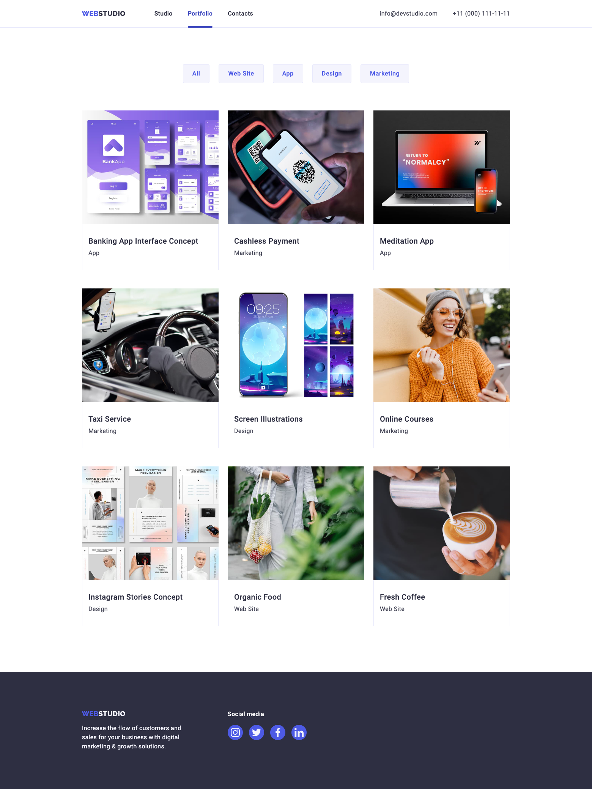

# Домашнє завдання № 4

- Створи репозиторій `goit-markup-hw-04`.
- Склонуй створений репозиторій і скопіюй в нього файли попередньої роботи.
- Додай розмітку і оформлення іконок і декоративних ефектів для сторінок з
  макета
  [**домашнього завдання #4**](<https://www.figma.com/file/Kr5Q4EVrEAqpOWko4QeEJb/Web-Studio-(Version-4.0)?type=design&node-id=297016-823&mode=design&t=YZkGzpXR0ga8rxQI-0>).
- Для генерації SVG-спрайту використовуй сервіс
  [**Icomoon**](https://icomoon.io/).
- Для оптимізації створеного SVG-спрайту використовуй сервіс
  [**svgomg**](https://jakearchibald.github.io/svgomg/).
- Налаштуй `GitHub Pages` і додай посилання на живу сторінку в шапку
  GitHub-репозиторія.

## Критерії приймання роботи наставником

### Проект

**`«A1»`** У корені проекту є папка `images` з зображеннями.

**`«A2»`** Усі векторні зображення (іконки) зібрані в SVG-спрайт `icons.svg`,
який лежить у папці `images`.

**`«A3»`** Усі векторні зображення оптимізовані.

**`«A4»`** У корені проекту є папка `css` з файлами стилів.

**`«A5»`** Всі стилі написані в одному файлі `styles.css`, який знаходиться в
папці `css`.

**`«A6»`** У назвах файлів відсутні великі літери, пробіли і трансліт, тільки
літери і слова англійської мови.

**`«A7»`** Вихідний код відформатований за допомогою `Prettier`.

**`«A8»`** Всі зображення та текстовий контент взяті з макета.

**`«A9»`** На всіх HTML-сторінках підключений нормалізатор стилів
[`modern-nomalize`](https://github.com/sindresorhus/modern-normalize).

**`«A10»`** Всі стилі написані в одному файлі `styles.css`, який знаходиться в
папці `css`.

**`«A11»`** Скрипт модального вікна підключений в HTML окремим файлом
`modal.js`.

**`«A12»`** Код написаний з дотриманням [**настанови**](https://codeguide.co/).

### Розмітка

**`«B1»`** Для всіх іконок використовується векторна графіка у форматі `svg`.

**`«B2»`** SVG-іконки експортовані правильно. При експорті обрана «група», а не
сам вектор.

**`«B3»`** Всі іконки з SVG-спрайту додані в HTML за допомогою тегів `<svg>` і
`<use>`

**`«B4»`** В секції `Переваг` додані іконки.

**`«B5»`** В секції `Команди` додані іконки соцмереж.

**`«B6»`** В секції `Клієнтів` додані іконки компаній.

**`«B7»`** У `футері` додані іконки соцмереж.

**`«B8»`** Виконана HTML-розмітка всіх елементів макету.

**`«B9»`** Теги використані відповідно до їх семантичного змісту.

### Оформлення

**`«C1»`** Велике зображення з ефектом затемнення (під хедером) виконано як фон.
Для затемнення використовується багатошаровий фон з градієнтом.

**`«C2»`** Фонове зображення в блоці під хедером не розтягується ширше свого
оригінального розміру `1440рх`.

**`«C3»`** У картках секції `Наша команда` є постійний ефект тіні.

**`«C4»`** У картках сторінки `Портфоліо` є ефект тіні при ховері в будь-якому
місці картки.

**`«C5»`** У фільтрі (список кнопок) сторінки `Портфоліо` є ефект тіні при
ховері або фокусі на кнопки.

**`«C6»`** При ховері або фокусі іконки повинні переходити в активний стан -
змінювати колір, якщо це зазначено в макеті.

**`«C7»`** Для всіх ефектів ховер і фокуса (колір, фон, тінь) зроблені переходи.
Час - `250ms`, функція розподілу часу - `cubic-bezier(0.4, 0, 0.2, 1)`.

**`«C8»`** У переходах та анімаціях явно зазначені анімовані властивості. Ніде
немає значення `all`.

**`«C9»`** В головній навігації, за допомогою псевдоелемента `::after`, зроблено
підкреслення посилання поточної сторінки (на якій зараз знаходиться користувач).

**`«C10»`** Оверлей з текстом на картках сторінки `Портфоліо` з'являється при
ховері та фокусі в будь-якому місці картки.

**`«C11»`** Синій оверлей в картках сторінки `Портфоліо` виїжджає знизу, як
показано на відео.


**`«C12»`** У псевдоелементів відсутній текстовий контент у властивості content.
Вони використані виключно для декоративного оформлення.

### Модальне вікно

**`«D1»`** Виконана розмітка і оформлення «бекдропа» (темного напівпрозорого
фону) модального вікна.

**`«D2»`** «Бекдроп» заповнює 100% висоти і ширини в'юпорту браузера і
фіксований в ньому.

**`«D3»`** Виконана розмітка і оформлення модального вікна.

**`«D4»`** Модальне вікно вертикально і горизонтально спозиційоване посередині
бекдропа.

**`«D5»`** Виконана розмітка і оформлення кнопки закриття модального вікна у
верхньому правому куті.

**`«D6»`** Спочатку модальне вікно і бекдроп приховані за допомогою класу
`is-hidden` на бекдропі, в селекторі якого використовуються властивості
`visibility`, `opacity` і `pointer-events`.

**`«D7»`** Якщо прибрати з бекдропа клас `is-hidden` - з'являється бекдроп і
модальне вікно.

**`«D8»`** Поява і приховування модального вікна анімовано за допомогою переходу
з довільним ефектом, наприклад `scale` або `translate`, і `opacity`.

### Відкриття/закриття модального вікна

Модальне вікно з формою заявки відкривається по натисканню на кнопку
`"Замовити послугу"`. Для того щоб скрипт спрацював, необхідно додати до
розмітки спеціальні атрибути, за якими скрипт шукає елементи:

- `data-modal-open` - на кнопку відкриття модального вікна.
- `data-modal-close` - на кнопку закриття модального вікна.
- `data-modal` - на бекдроп модального вікна.

Після чого, перед закриваючим тегом `body` додати тег `script` з посиланням на
файл скрипту для модально вікна. Можна подивитися
[відео-інструкцію](https://drive.google.com/file/d/1yasixN2K-9DdsYtKCJWVay9WbyTZai0t/view).

```html
<body>
  <!-- Вся твоя розмітка, включно з розміткою модалки -->

  <!-- Ставимо перед закриваючим тегом body -->
  <script src="./js/modal.js"></script>
</body>
```

Скрипт, який необхідно скопіювати і вставити у файл `modal.js`.

```js
(() => {
  const refs = {
    openModalBtn: document.querySelector('[data-modal-open]'),
    closeModalBtn: document.querySelector('[data-modal-close]'),
    modal: document.querySelector('[data-modal]'),
  };

  refs.openModalBtn.addEventListener('click', toggleModal);
  refs.closeModalBtn.addEventListener('click', toggleModal);

  function toggleModal() {
    refs.modal.classList.toggle('is-hidden');
  }
})();
```

# Web Studio


---



---
